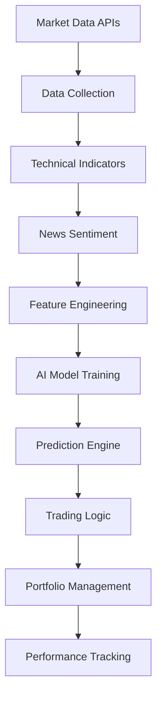
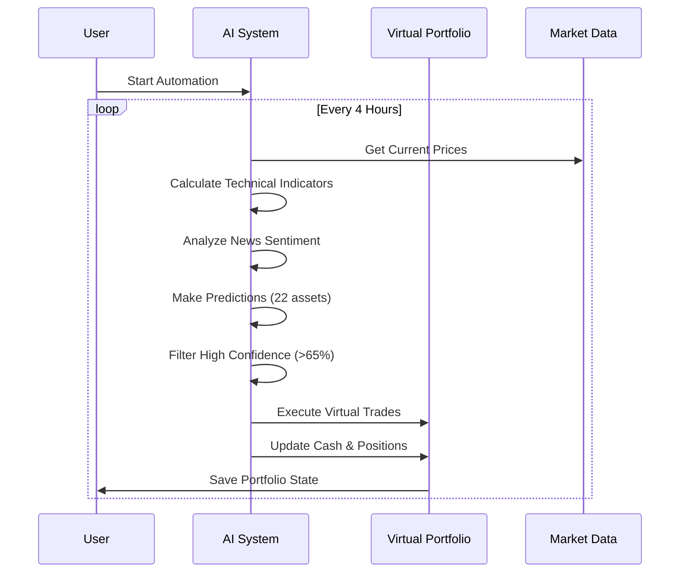

# Project Flow Guide

## Table of Contents
- [🚀 Getting Started](#-getting-started)
- [📊 System Overview](#-system-overview)
- [🔄 Complete Workflow](#-complete-workflow)
- [💼 Portfolio Management](#-portfolio-management)
- [🤖 Automation Options](#-automation-options)
- [📈 Monitoring & Analysis](#-monitoring--analysis)
- [⚙️ Advanced Configuration](#️-advanced-configuration)
- [🔧 Troubleshooting](#-troubleshooting)

## 🚀 Getting Started

### Step 1: Initial Setup

1. **Environment Setup**
```bash
# Check Python version (3.9+ required)
python --version

# Install dependencies
pip install -r requirements.txt

# Verify installation
python -c "import yfinance, pandas, sklearn; print('✅ All dependencies installed')"
```

2. **First Run - Model Training**
```bash
# If no models exist, the system will automatically:
# 1. Download 5 years of market data for 22 assets
# 2. Calculate technical indicators 
# 3. Train AI models (takes 10-15 minutes)
# 4. Save models to /models directory

python automation/daily_automation.py
# Choose option 3: System health check
```

### Step 2: Create Your Virtual Portfolio

```bash
# Initialize your first portfolio
python create_portfolio.py

# Check portfolio status
python check_portfolio.py
```

**Expected Output:**
```
📊 CURRENT VIRTUAL PORTFOLIO
💰 Cash: $10,000.00
📈 Positions: 0
📅 Started: 2025-09-12
📝 Trades Made: 0
```

### Step 3: Test AI Predictions

```bash
python automation/daily_automation.py
# Choose option 4: Get AI predictions

# You'll see predictions like:
# MSFT: UP (77.7% confidence)
# NVDA: UP (66.4% confidence)
# BNB_USD: UP (68.8% confidence)
```

## 📊 System Overview

### Data Flow Architecture



### Asset Coverage

| Category | Assets | Count |
|----------|--------|-------|
| **Stocks** | AAPL, MSFT, GOOGL, NVDA, TSLA, META, AMZN, NFLX, AMD, INTC | 10 |
| **Crypto** | BTC, ETH, SOL, BNB, ADA, DOGE | 6 |
| **Forex** | EUR/USD, GBP/USD, AUD/USD, USD/CAD, USD/CHF, USD/JPY | 6 |
| **Total** | | **22** |

## 🔄 Complete Workflow

### Phase 1: Data Preparation (One-time Setup)

```bash
# 1. Collect historical data
python CollectStocksData.py

# 2. Add technical indicators
python AddIndicatorsToStocksData.py

# 3. Train AI models (happens automatically on first run)
python automation/daily_automation.py
```

**What happens:**
- Downloads 5 years of price data for all 22 assets
- Calculates 17+ technical indicators (RSI, MACD, Bollinger Bands, etc.)
- Trains Random Forest models for each asset
- Saves trained models as `.joblib` files

### Phase 2: Live Trading Setup

```bash
# Option A: Manual execution (you control when)
python automation/daily_automation.py
# Choose option 1: Run daily automation

# Option B: Continuous automation (runs every 4 hours)
python automation/daily_automation.py  
# Choose option 5: Continuous automation

# Option C: Just predictions (no trading)
python automation/daily_automation.py
# Choose option 4: Get AI predictions
```

### Phase 3: Portfolio Evolution



## 💼 Portfolio Management

### Understanding Your Virtual Portfolio

Your portfolio starts with **$10,000 virtual money** and tracks:
- **Cash Balance**: Available for new trades
- **Stock Positions**: Current holdings with shares and average price
- **Trade History**: Complete log of all transactions
- **Portfolio Value**: Total worth (cash + stock value)

### Portfolio File Structure

```json
{
  "cash": 2000.00,
  "positions": {
    "AAPL": {
      "shares": 8.70,
      "avg_price": 229.83,
      "last_updated": "2025-09-12T02:08:21"
    }
  },
  "trade_history": [
    {
      "timestamp": "2025-09-12T02:08:21",
      "symbol": "AAPL",
      "action": "BUY",
      "shares": 8.70,
      "price": 229.83,
      "amount": 2000.00
    }
  ],
  "start_date": "2025-09-12T02:08:21"
}
```

### Risk Management Rules

- **Maximum Position Size**: 20% of portfolio per asset ($2,000 max)
- **Minimum Trade**: $100 per transaction
- **High Confidence Threshold**: 65% AI confidence required
- **Stop Loss**: Sell 50% of position on DOWN signals
- **Cash Management**: Never use more than 50% of available cash per trade

### Portfolio Commands

```bash
# View current portfolio
python check_portfolio.py

# Create new portfolio (resets to $10,000)
python create_portfolio.py

# Manual trading interface
python automation/daily_automation.py
# Choose option 2: Paper trading only
```

## 🤖 Automation Options

### Option 1: Manual Control
**Best for**: Learning and testing
```bash
python automation/daily_automation.py
# Choose option 1: Run daily automation
```
- **When**: You decide when to run
- **Duration**: 10-30 seconds per run  
- **Your time**: 2-5 minutes per run
- **Control**: Full control over timing

### Option 2: Continuous Automation
**Best for**: Hands-off trading
```bash
python automation/daily_automation.py
# Choose option 5: Continuous automation (every 4 hours)
```
- **When**: Automatically every 4 hours
- **Duration**: Runs until you stop it (Ctrl+C)
- **Your time**: 0 minutes daily
- **Control**: Stop anytime with Ctrl+C

### Option 3: Scheduled Tasks
**Best for**: Specific timing requirements

**Windows Task Scheduler:**
```bash
# Create scheduled task to run daily at 9:00 AM
schtasks /create /tn "AI Trading" /tr "python C:\path\to\automation\daily_automation.py" /sc daily /st 09:00
```

**Linux/Mac Cron:**
```bash
# Add to crontab for daily 9:00 AM execution
0 9 * * * cd /path/to/TradingAiCode && python automation/daily_automation.py
```

### Automation Flow Comparison

| Mode | Frequency | Setup Time | Your Involvement | Best For |
|------|-----------|------------|------------------|----------|
| **Manual** | On-demand | 0 min | 5 min/run | Learning, testing |
| **Continuous** | Every 4 hours | 0 min | 0 min/day | Set-and-forget |
| **Scheduled** | Custom times | 10 min | 0 min/day | Specific schedules |

## 📈 Monitoring & Analysis

### Real-time Portfolio Tracking

```bash
# Quick portfolio status
python check_portfolio.py

# Detailed portfolio analysis with recent trades
python automation/daily_automation.py
# Choose option 3: System health check
```

### Performance Metrics

The system tracks:
- **Total Portfolio Value**: Current worth vs $10,000 starting capital
- **Individual Position P&L**: Profit/loss per stock
- **Trade Success Rate**: Percentage of profitable trades
- **AI Confidence Accuracy**: How well confidence scores predict success
- **Risk Metrics**: Position sizes and exposure levels

### Portfolio Analysis Example

```
📊 PORTFOLIO SUMMARY:
💵 Cash: $2,000.00
📈 Stock Value: $8,000.00  
🏆 Total Value: $10,000.00 (0.0% gain)

📈 TOP PERFORMERS:
✅ MSFT: +15.2% ($300 gain)
✅ NVDA: +8.7% ($174 gain)
❌ AAPL: -3.1% ($62 loss)

📝 RECENT TRADES:
2025-09-12 - BUY MSFT @ $500.64 (77.7% confidence)
2025-09-12 - BUY NVDA @ $177.28 (66.4% confidence)
2025-09-11 - SELL TSLA @ $366.87 (DOWN signal)
```

## ⚙️ Advanced Configuration

### Customizing AI Parameters

Edit `src/testing/paper_trader.py` to modify:

```python
# Trading parameters
min_confidence = 0.65        # Minimum AI confidence (65%)
max_position_size = 0.2      # Max 20% per position
min_trade_amount = 100       # Minimum $100 per trade
cash_usage_limit = 0.5       # Use max 50% of cash per trade
```

### Adding New Assets

1. Add symbol to asset list in `CollectStocksData.py`
2. Run data collection: `python CollectStocksData.py`
3. Add indicators: `python AddIndicatorsToStocksData.py`
4. Retrain models: Delete `/models` folder and run automation

### Model Retraining

```bash
# Force model retraining (deletes existing models)
Remove-Item -Recurse models/
python automation/daily_automation.py
# System will automatically retrain all models
```

## 🔧 Troubleshooting

### Common Issues & Solutions

#### Issue: "No module named 'prediction.predictor'"
```bash
# Solution: Check file paths and imports
python -c "from src.prediction.prediction_system import StockPredictor; print('✅ Import works')"
```

#### Issue: Portfolio file not found
```bash
# Solution: Create the outputs directory
mkdir outputs
python create_portfolio.py
```

#### Issue: API rate limits / price data errors
```bash
# Solution: Wait and retry, or check specific symbols
python automation/daily_automation.py
# Choose option 3: System health check
```

#### Issue: Low AI accuracy
- **Normal**: 52-55% accuracy is good for financial markets
- **Improvement**: More data, additional indicators, parameter tuning
- **Reality**: Even 52% accuracy + risk management = profitable

### Debug Mode

Enable detailed logging by editing automation scripts:
```python
# Add at top of daily_automation.py
import logging
logging.basicConfig(level=logging.DEBUG)
```

### Performance Optimization

```bash
# Check system performance
python -c "
import time
start = time.time()
from src.prediction.prediction_system import StockPredictor
predictor = StockPredictor()
predictions = predictor.predict_all()
print(f'Prediction time: {time.time() - start:.2f} seconds')
"
```

---

## 🎯 Quick Reference Commands

| Task | Command |
|------|---------|
| **Start automation** | `python automation/daily_automation.py` |
| **Check portfolio** | `python check_portfolio.py` |
| **Get predictions** | Choose option 4 in automation menu |
| **System health** | Choose option 3 in automation menu |
| **Reset portfolio** | `python create_portfolio.py` |
| **Manual trading** | Choose option 2 in automation menu |

---

*This guide covers the complete project workflow from setup to advanced usage. For technical details, see the main README.md file.*
