# Portfolio Creation & Management Flow

## 📊 Portfolio Lifecycle Flowchart

```mermaid
flowchart TD
    A[Start] --> B{Portfolio Exists?}
    
    B -->|No| C[Create New Portfolio]
    B -->|Yes| D[Load Existing Portfolio]
    
    C --> C1[Initialize $10,000 Cash]
    C1 --> C2[Zero Stock Positions]
    C2 --> C3[Empty Trade History]
    C3 --> C4[Save to JSON File]
    C4 --> E[Portfolio Ready]
    
    D --> D1[Load Cash Balance]
    D1 --> D2[Load Stock Positions]
    D2 --> D3[Load Trade History]
    D3 --> E
    
    E --> F[Start AI Analysis]
    F --> G[Get Market Data]
    G --> H[Calculate Technical Indicators]
    H --> I[Make AI Predictions]
    I --> J{High Confidence?}
    
    J -->|Yes ≥65%| K[Trading Decision]
    J -->|No <65%| L[Skip Trade]
    
    K --> K1{Prediction Direction}
    K1 -->|UP| M[Buy Signal]
    K1 -->|DOWN| N[Sell Signal]
    
    M --> M1{Have Cash?}
    M1 -->|Yes| M2[Calculate Position Size]
    M1 -->|No| L
    M2 --> M3[Execute BUY Trade]
    M3 --> O[Update Portfolio]
    
    N --> N1{Have Position?}
    N1 -->|Yes| N2[Calculate Sell Amount]
    N1 -->|No| L
    N2 --> N3[Execute SELL Trade]
    N3 --> O
    
    O --> O1[Update Cash Balance]
    O1 --> O2[Update Stock Positions]
    O2 --> O3[Add to Trade History]
    O3 --> O4[Save Portfolio to File]
    O4 --> P[Portfolio Updated]
    
    L --> P
    P --> Q{Continue Automation?}
    Q -->|Yes| R[Wait 4 Hours]
    Q -->|No| S[End]
    R --> F
```



## 🔄 Step-by-Step Portfolio Creation

### Initial Setup
```bash
# 1. Check if portfolio exists
python check_portfolio.py
# Output: "❌ No portfolio file found yet"

# 2. Create your first portfolio  
python create_portfolio.py
# Output: "🆕 Initialized new portfolio with $10,000.00"

# 3. Verify portfolio creation
python check_portfolio.py
# Output: Shows $10,000 cash, 0 positions
```

### First Trading Cycle
```bash
# 4. Start automation
python automation/daily_automation.py
# Choose option 2: Paper trading only

# What happens internally:
# → Load portfolio: $10,000 cash
# → AI finds: MSFT UP (77.7% confidence)
# → Execute: BUY $2,000 worth of MSFT  
# → Update: $8,000 cash + MSFT position
# → Save: Portfolio file updated
```

### Portfolio Evolution Example

#### Day 1: Initial State
```json
{
  "cash": 10000.00,
  "positions": {},
  "trade_history": []
}
```

#### Day 1: After First AI Trading
```json
{
  "cash": 6000.00,
  "positions": {
    "MSFT": {"shares": 3.99, "avg_price": 500.64},
    "NVDA": {"shares": 11.28, "avg_price": 177.28}
  },
  "trade_history": [
    {"action": "BUY", "symbol": "MSFT", "amount": 2000.00},
    {"action": "BUY", "symbol": "NVDA", "amount": 2000.00}
  ]
}
```

#### Day 7: After Week of Trading
```json
{
  "cash": 3500.00,
  "positions": {
    "MSFT": {"shares": 3.99, "avg_price": 500.64},
    "AAPL": {"shares": 8.70, "avg_price": 229.83},
    "TSLA": {"shares": 2.73, "avg_price": 183.45}
  },
  "trade_history": [
    "... 8 total trades ..."
  ]
}
```

## 💡 Portfolio Management Rules

### Risk Management
- **Maximum position**: 20% of total portfolio ($2,000 max per stock)
- **Minimum trade**: $100 per transaction
- **Cash reserve**: Always keep some cash for opportunities
- **Diversification**: AI spreads risk across multiple assets

### Trading Logic
```python
# Simplified trading logic
if ai_prediction == "UP" and confidence >= 65%:
    if symbol not in portfolio.positions:
        max_investment = min(portfolio.cash * 0.5, portfolio.total_value * 0.2)
        execute_buy(symbol, amount=max_investment)

elif ai_prediction == "DOWN" and confidence >= 65%:
    if symbol in portfolio.positions:
        sell_amount = portfolio.positions[symbol].shares * 0.5
        execute_sell(symbol, shares=sell_amount)
```

### Portfolio Health Monitoring
```bash
# Check portfolio status anytime
python check_portfolio.py

# Example output:
📊 CURRENT VIRTUAL PORTFOLIO
💰 Cash: $2,000.00
📈 Positions: 4
🏆 Total Value: $10,000.00

🏪 CURRENT HOLDINGS:
  AAPL: 8.70 shares @ $229.83 = $2,000.00
  MSFT: 3.99 shares @ $500.64 = $2,000.00
  NVDA: 11.28 shares @ $177.28 = $2,000.00
  TSLA: 5.45 shares @ $366.87 = $2,000.00

📝 RECENT TRADES:
  2025-09-12 - BUY MSFT @ $500.64
  2025-09-12 - BUY NVDA @ $177.28
  2025-09-12 - BUY TSLA @ $366.87
```

## 🎯 Portfolio Commands Quick Reference

| Task | Command | Expected Result |
|------|---------|-----------------|
| **Create portfolio** | `python create_portfolio.py` | New $10,000 virtual portfolio |
| **Check status** | `python check_portfolio.py` | Current cash, positions, trades |
| **Start trading** | `python automation/daily_automation.py` → Option 2 | AI makes trades |
| **Get predictions** | `python automation/daily_automation.py` → Option 4 | AI predictions only |
| **Continuous trading** | `python automation/daily_automation.py` → Option 5 | Auto-trade every 4 hours |

---

*This flow shows exactly how your virtual portfolio is created, managed, and evolves through AI trading decisions.*
